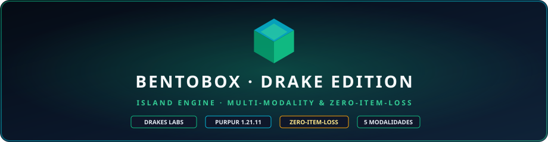

<div align="center">



# ✦ BentoBox · DrakesCraft Edition ✦

### High-Performance Island Engine, Data Components Deserializer & Multi-Modality Controller for DrakesCraft

[](https://reporanker.com/repos/DrakesCraft-Labs/BentoBox-Drake)
[](https://papermc.io/)
[](https://purpurmc.org/)
[](https://openjdk.org/)
[](./LICENSE)
[](https://github.com/DrakesCraft-Labs/BentoBox-Drake)
[](https://web.drakescraft.cl)

**A sovereign downstream fork of BentoBox tailored for Purpur/Paper 1.21.11, providing native Data Components item resilience, seamless Slimefun4 compatibility, and multi-modal isolation across DrakesCraft's 5 game modes.**

[🌐 Portal Oficial](https://web.drakescraft.cl) ·
[🎮 Jugar en Vivo](https://web.drakescraft.cl/play) ·
[💬 Discord Oficial](https://discord.gg/rv3vtXZTk7) ·
[🏛️ Organización GitHub](https://github.com/DrakesCraft-Labs)

</div>

---

> ### 🏰 ¡Únete a la Red Oficial de DrakesCraft!
>
> * 🎮 **IP del Servidor (Java & Bedrock):** `play.drakescraft.cl` *(Puerto Java: `25565` | Puerto Bedrock: `19132`)*
> * 💬 **Discord de la Comunidad:** [discord.gg/drakescraft](https://discord.gg/rv3vtXZTk7)
> * 🌐 **Sitio Web:** [web.drakescraft.cl](https://web.drakescraft.cl) · 🛒 **Tienda Oficial:** [web.drakescraft.cl/store](https://web.drakescraft.cl/store.html)
>
> *¡Juega en nuestras modalidades de OneBlock y SkyBlock impulsadas por este motor en vivo!*

---

## 🙏 Reconocimiento y Agradecimientos a BentoBoxWorld

Queremos expresar nuestro más sincero y profundo agradecimiento a **tastybento**, **Poslovitch** y a toda la **Comunidad de BentoBoxWorld** por haber concebido y mantenido uno de los sistemas de islas más modulares, elegantes y revolucionarios del ecosistema de servidores de Minecraft. 

Este repositorio (`BentoBox-Drake`) es un fork downstream de optimización creado para resolver necesidades específicas de integración con Paper Data Components (1.20.5+ / 1.21.11) y la arquitectura multi-modal de **DrakesCraft**.

---

## 🌟 Pilares y Mejoras de la Edición DrakesCraft

### 1. 🛡️ Resiliencia de Deserialización de Ítems (`Zero-Item-Loss` / Fix Incidente #276)
- **Problema en Upstream:** En Minecraft moderno (1.20.5+ y 1.21.11), Paper serializa modificadores y metadatos bajo Data Components (ej: `minecraft:attribute_modifiers: [{type: "minecraft:attack_damage"}]`). El método `ItemStackTypeAdapter.read` original buscaba ciegamente la subcadena `type:`, confundiendo el atributo del charm de Slimefun con el material del ítem y retornando prematuramente `Material.AIR`, destruyendo los ítems del jugador al cambiar de mundo o reiniciar sesión.
- **Solución Drake:** Implementa deserialización nativa directa de Bukkit/Paper (`YamlConfiguration.loadFromString` + `getItemStack("is")`), garantizando que **el 100% de los charms de Slimefun, armas con atributos custom y lore extendido se conserven intactos** sin pérdida de inventario.

### 2. ⚡ Compatibilidad y Rendimiento en Purpur 1.21.11
- Optimizado para Java 21 y Java 25 con runtime Purpur 1.21.11.
- Mapeos de Mojang limpios y compatibilidad total con remapeo dinámico de Paper.

### 3. 🌐 Armonización de las 5 Modalidades de DrakesCraft
BentoBox-Drake convive armónicamente con las 5 modalidades de la network sin generar cruces de inventarios ni interferencias:

| Modalidad | Mundos de Juego | Motor Activo | Slimefun / Reglas |
| :--- | :--- | :--- | :--- |
| 🛡️ **Survival Principal** | `world`, `world_nether`, `world_the_end` | Odysseia / WorldGuard | Slimefun4 + Economía + PvP |
| 📦 **OneBlock** | `oneblock_world` (+ Nether/End) | **BentoBox AOneBlock** | Slimefun4 + Fases OneBlock |
| ☁️ **SkyBlock** | `bskyblock_world` (+ Nether/End) | **BentoBox BSkyBlock** | Slimefun4 + Islas de Nivel |
| 🌲 **Clásico Vainilla** | `clasico` (+ Nether/End) | Vainilla Puro | Sin Slimefun / Inventario Aislado |
| 🧪 **Laboratorio** | `laboratorio` | Creativo / Pruebas | Redstone, Circuitos & Testing |

---

## 📦 Compilación e Instalación

### Compilar desde el Código Fuente
```bash
# Clonar el repositorio
git clone https://github.com/DrakesCraft-Labs/BentoBox-Drake.git
cd BentoBox-Drake

# Compilar con Gradle (Java 21+)
./gradlew shadowJar
```

El binario optimizado se generará en `build/libs/BentoBox-*.jar`.

### Instalación en el Servidor
1. Coloca `BentoBox.jar` en la carpeta `/plugins/` de tu servidor Purpur/Paper 1.21.11.
2. Coloca los addons correspondientes (`AOneBlock.jar`, `BSkyBlock.jar`, `Level.jar`, `InvSwitcher.jar`, `MagicCobblestoneGenerator.jar`) en `/plugins/BentoBox/addons/`.
3. Inicia el servidor.

---

## 📄 Licencia

Este proyecto está licenciado bajo la **GNU General Public License v3.0 (GPLv3)** en conformidad con el proyecto original de [BentoBoxWorld](https://github.com/BentoBoxWorld/BentoBox).
